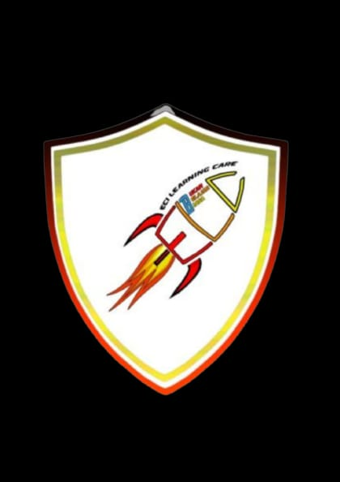

<p align="center">
  
</p>

<h1 align="center">🏆 EVENT 2025 – Online Registration Form</h1>

<p align="center">
  <b>Website Form Registrasi Perlombaan Modern, Cepat, dan Terintegrasi Otomatis</b>
</p>

<p align="center">
  <a href="https://event-2025-form.vercel.app/" target="_blank">
    🌐 Live Demo
  </a>
  ·
  <a href="https://github.com/abdussalam090207/EVENT-2025-Form">
    📦 Repository
  </a>
</p>

<p align="center">
  
  
  
  
  
  
</p>

---

## 📖 Deskripsi Project

**EVENT 2025 – Online Registration Form** adalah website form pendaftaran lomba berbasis web yang dirancang untuk memudahkan proses registrasi peserta secara **online**, **otomatis**, dan **real-time**.

Website ini menggunakan **HTML, CSS, dan JavaScript** sebagai frontend, serta **Google Apps Script** yang terhubung langsung ke **Google Spreadsheet** sebagai database, tanpa perlu server backend tambahan.

---

## ✨ Fitur Unggulan

- 📋 Form registrasi perlombaan online
- 📊 Data otomatis masuk ke Google Spreadsheet
- ⚡ Fast loading & lightweight
- 📱 Fully responsive (Mobile & Desktop)
- 🔔 Integrasi WhatsApp Group via modal
- 🎨 UI modern & clean
- 🕒 Countdown / batas waktu pendaftaran
- ❌ Custom halaman 404 (Not Found)
- 🗂️ Multi kategori lomba

---

## 🛠️ Teknologi yang Digunakan

| Teknologi | Fungsi |
|---------|-------|
| **HTML5** | Struktur halaman |
| **CSS3** | Styling & layout |
| **JavaScript** | Interaksi & validasi |
| **Google Apps Script** | Backend API |
| **Google Spreadsheet** | Database |
| **Vercel** | Hosting & deployment |

---

## 📂 Struktur Folder
```
EVENT-2025-Form/
├── Asset/
├── EVENT-2025-Form/
├── EXPO/
├── Finalis SOY/
├── Halaman Utama/
├── Kalender/
├── Kontak/
├── MPRO Junior/
├── MPRO Senior/
├── MPRO Senior 2026/
├── Notfound/
├── footer.css
├── index.html
└── index-waktuhabis.html
```
---

## 🖼️ Preview Tampilan

<p align="center">
  
  
  
  
</p>


## 🚀 Cara Menjalankan Project (Local)

```
git clone https://github.com/abdussalam090207/EVENT-2025-Form.git
```
```
cd EVENT-2025-Form
```

### ⚙️ Konfigurasi Google Apps Script

- Buat project Google Apps Script
- Hubungkan ke Google Spreadsheet
- Deploy sebagai Web App
- Set akses ke: Anyone
- Method request: POST
- Masukkan URL Web App ke JavaScript

---

### 📊 Database

- Semua data peserta tersimpan otomatis
- Real-time & aman
- Mudah diekspor ke Excel / CSV
- Tidak memerlukan server hosting tambahan

### 👨‍💻 Developer

**Abdus Salam**
* 🎓 SMKN 26 Jakarta – SIJA
* 📌 EVENT 2025 Registration System

🔗 GitHub: <p> <a href="https://github.com/abdussalam090207"> abdussalam090207 </p>

### ⭐ Dukungan

Jika project ini bermanfaat:
* ⭐ Beri star pada repository
* 🔄 Fork untuk dikembangkan
* 💬 Kirim feedback atau ide fitur baru

### 📜 Lisensi

> Project ini dibuat untuk kebutuhan edukasi dan event.
> Bebas digunakan dan dikembangkan dengan mencantumkan kredit.
